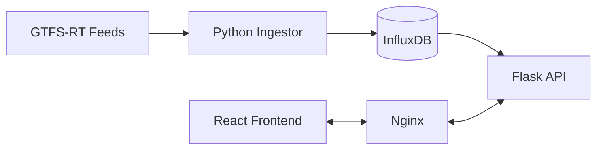

# WIMBAC (When Is My Bus Actually Coming?)

**Web-Integrated Monitoring of Public Transit Activity in Cleveland**

WIMBAC is a real-time transit analytics platform that ingests GTFS-Realtime feeds, persists vehicle telemetry in a time-series database, and visualizes system-wide activity through a modern React dashboard.

**Live:** [https://www.wimbac.com](https://www.wimbac.com)

## Overview

WIMBAC is a full-stack engineering exercise in high-frequency data ingestion, storage, and visualization. It moves beyond simple "map markers" to provide a platform for analyzing transit reliability and vehicle spatial relationships in real-time.

### Core Features
- **Asynchronous Ingestion:** 20–30s interval GTFS-RT ingestion pipeline.
- **Time-Series Storage:** High-cardinality telemetry storage using InfluxDB.
- **Modern Frontend:** Decoupled React/TypeScript SPA with responsive MapBox/Leaflet integration.
- **Transit Analytics:** Stop-level reliability metrics and on-time performance analysis.
- **Production Infrastructure:** High-performance deployment using Nginx as a reverse proxy and static asset server.

---

## System Architecture

| Layer | Technology | Role |
| :--- | :--- | :--- |
| **Frontend** | React, TypeScript, Vite | Component-based UI & State Management |
| **API** | Python, Flask, Gunicorn | RESTful endpoints & Data Orchestration |
| **Database** | InfluxDB (Flux/FluxQL) | Time-series persistence & Analytics |
| **Ingestion** | Python (Requests/Protobuf) | Feed normalization & Spatial processing |
| **Gateway** | Nginx | Reverse Proxy, SSL, & Static File Delivery |

---

## Technical Stack

### Frontend (The Dashboard)
- **React 18 & TypeScript:** Built for type safety and component reusability.
- **Leaflet:** Managed via `react-leaflet` for reactive map interactions.
- **Vite:** Modern build toolchain for optimized production assets.
- **Axios:** Efficient polling and data fetching with custom error handling.

### Backend (The Engine)
- **Flask:** Lightweight API serving real-time vehicle positions and InfluxDB aggregates.
- **InfluxDB:** Optimized schema handling high-write telemetry throughput.
- **GTFS-Realtime:** Protocol buffer ingestion and normalization.

### Infrastructure
- **Vultr VPS:** Cloud-based Debian environment.
- **Nginx:** Configured as a reverse proxy to bridge the decoupled React frontend and Flask API.
- **Systemd:** Process management and service reliability.

---

## Data Engineering & Storage

WIMBAC treats transit data as a continuous stream. By utilizing **InfluxDB**, we can perform complex temporal queries (e.g., "What was the average delay at Stop X over the last 14 days?") that traditional SQL databases struggle with at scale.

**Measurement:** `vehicle_status`
- **Tags (Indexed):** `vehicle_id`, `route_id`, `trip_id`, `next_stop_id`
- **Fields:** `lat`, `lon`

*Note: Migrated `trip_id` from field to tag in March 2026 to optimize query performance and series cardinality.*

---

## Deployment Pattern

WIMBAC uses a **Single-Origin Proxy** architecture. Nginx acts as the primary entry point:
1. **Static Assets:** Nginx serves the compiled React `dist/` folder directly for maximum speed.
2. **API Handshake:** Requests to `/api/*` are transparently proxied to Gunicorn, keeping the backend protected and solving CORS issues at the infrastructure level.

---

## Design Principles

- **Decoupling:** Frontend and Backend are strictly separated, allowing for independent scaling and testing.
- **Type Safety:** Using TypeScript interfaces to define data contracts between the InfluxDB results and the UI.
- **Visibility:** Built-in logging and status checks to monitor feed health and database ingestion rates.

## Next Steps
- **Visual Analytics:** Implement Recharts for stop-level reliability trends.
- **Mobile Optimization:** Refactor popups into a slide-in bottom sheet for better mobile UX.
- **Clustering:** Add Leaflet marker clustering for system-wide views.
- **AWS Migration:** Evaluating transition to EC2 and Managed InfluxDB for increased uptime.